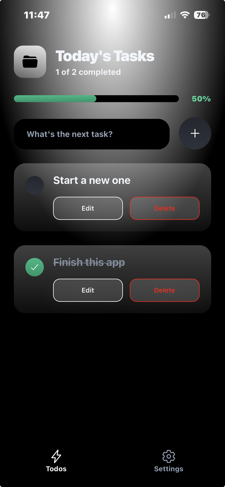
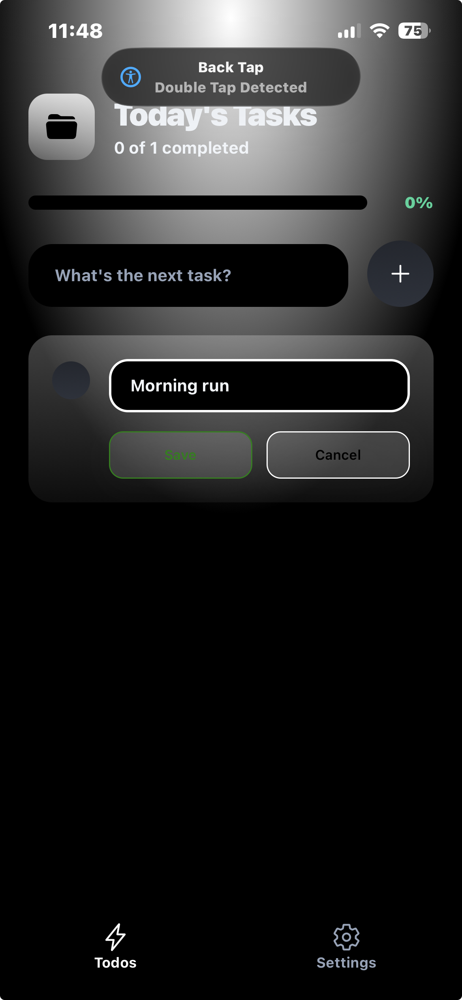
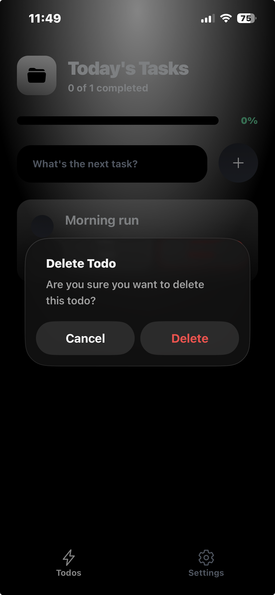

# 📱 Todo App

A beautiful and modern todo application built with React Native and Expo, featuring a sleek UI with gradient backgrounds, smooth animations, and real-time data synchronization using Convex.



## ✨ Features

- ✅ **Add Todos** - Create new tasks with a simple input interface
- ✏️ **Edit Todos** - Update existing todos inline with a clean editing experience
- 🗑️ **Delete Todos** - Remove tasks with a confirmation dialog
- ☑️ **Toggle Completion** - Mark todos as complete or incomplete
- 🌓 **Theme Support** - Automatic dark/light mode based on system preferences
- 📱 **Cross-Platform** - Works on iOS, Android, and Web
- 🔄 **Real-time Sync** - Data synchronized in real-time using Convex backend
- 🎨 **Beautiful UI** - Modern design with gradient backgrounds and smooth animations

## 📸 Screenshots

### Main Screen

The main screen displays all your todos with a beautiful gradient background and intuitive interface.


### Empty State

When you don't have any todos yet, a helpful empty state is displayed.


### Edit Functionality

Edit todos inline with a clean editing interface that includes save and cancel options.



### Delete Confirmation

Delete todos with a confirmation dialog to prevent accidental deletions.



## 🚀 Getting Started

### Prerequisites

- Node.js (v18 or higher)
- npm, yarn, or bun
- Expo CLI (optional, can use npx)
- iOS Simulator (for Mac) or Android Emulator (optional, can use Expo Go)

### Installation

1. **Clone the repository**

   ```bash
   git clone <repository-url>
   cd todo_app
   ```

2. **Install dependencies**

   ```bash
   npm install
   # or
   yarn install
   # or
   bun install
   ```

3. **Set up Convex**

   Make sure you have a Convex account and project set up. Configure your Convex deployment URL in your environment variables or Convex configuration.

4. **Start the development server**

   ```bash
   npm start
   # or
   npx expo start
   ```

5. **Run on your preferred platform**
   - Press `i` for iOS simulator
   - Press `a` for Android emulator
   - Press `w` for web browser
   - Scan QR code with Expo Go app on your device

## 🛠️ Tech Stack

- **Framework**: [Expo](https://expo.dev/) (~54.0.27)
- **React Native**: 0.81.5
- **React**: 19.1.0
- **Backend**: [Convex](https://www.convex.dev/) (^1.31.0)
- **Navigation**: Expo Router (~6.0.17)
- **UI Components**:
  - Expo Linear Gradient
  - React Native SVG
  - Expo Vector Icons
- **State Management**: Convex React hooks
- **Storage**: AsyncStorage for local preferences

## 📁 Project Structure

```
todo_app/
├── app/                    # App screens and routing
│   ├── (tabs)/            # Tab navigation screens
│   │   ├── index.tsx      # Main todo screen
│   │   └── settings.tsx   # Settings screen
│   └── _layout.tsx        # Root layout
├── components/            # Reusable components
│   ├── empty-list.tsx     # Empty state component
│   ├── header.tsx         # Header component
│   ├── spinner.tsx        # Loading spinner
│   └── todoinput.tsx      # Todo input component
├── convex/                # Convex backend
│   ├── schema.ts          # Database schema
│   └── todos.ts           # Todo mutations and queries
├── hooks/                 # Custom React hooks
│   └── use-theme.tsx      # Theme management hook
├── assets/                # Static assets
│   ├── images/            # App icons and images
│   └── readme/            # README screenshots
└── package.json           # Dependencies and scripts
```

## 🎯 Key Features Explained

### Real-time Data Sync

The app uses Convex for real-time data synchronization. All todos are stored in the cloud and automatically sync across all devices.

### Inline Editing

Todos can be edited directly in the list with an inline editing interface that appears when you tap the edit button.

### Confirmation Dialogs

Delete operations include a confirmation dialog to prevent accidental data loss.

### Theme Support

The app automatically adapts to your device's theme preference (dark/light mode) with beautiful gradient backgrounds.

## 📝 Available Scripts

- `npm start` - Start the Expo development server
- `npm run android` - Run on Android emulator
- `npm run ios` - Run on iOS simulator
- `npm run web` - Run in web browser
- `npm run lint` - Run ESLint

## 🔧 Configuration

### Convex Setup

1. Create a Convex account at [convex.dev](https://www.convex.dev)
2. Create a new project
3. Configure your Convex deployment URL
4. Deploy your schema and functions

The app uses the following Convex schema:

- `todos` table with `title` (string) and `isComplete` (boolean) fields
